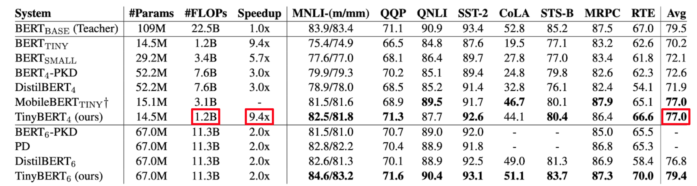
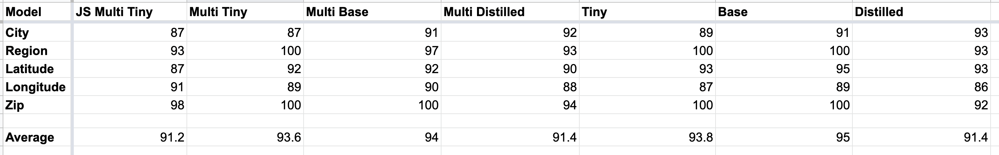

  
  
  
  
  
  
  
  
  

# Privacy Pioneer Machine Learning

[1. What Is in This Repo?](#1-what-is-in-this-repo)  
[2. What Did We Do?](#2-what-did-we-do)  
[3. Links to Datasets and Final Models](#3-links-to-datasets-and-final-models)  
[4. What Libraries, Technologies, and Techniques Are We Using?](#4-what-libraries-technologies-and-techniques-are-we-using)  
[5. Thank You!](#5-thank-you)

## 1. What Is in This Repo?

[Privacy Pioneer](https://github.com/privacy-tech-lab/privacy-pioneer) is a browser extension built with the purpose of helping people understand the privacy implications of their visits to websites. We realized that we could improve the extension by utilizing machine learning to remove false positives (incorrect results) from being distributed to our users. We created binary text classification models that would intake possible examples of personal location identifiers and would inform the extension whether or not it was a true case of personal data being shared.

This repo contains everything machine learning-related to Privacy Pioneer:

- The datasets we used for training, validation, and testing the models.
- Links to all final models we produced.
- The model that is loaded into the Privacy Pioneer extension.

## 2. What Did We Do?

We had to create a way to integrate Machine Learning into a browser extension. This brought up a few questions to answer:

- Where do we want this model to be stored?
- Which pre-trained model to use?
- What is the process for model training?
- How did it get into the extension?

The Privacy Pioneer extension is structured around distributing information about how websites are taking your data and sending it to third parties without your explicit consent or knowledge. Thus we want this machine learning functionality to run locally on a user's browser. This means that we need a small, fast, accurate model to be stored and running within the extension itself.

[BERT](https://arxiv.org/abs/1810.04805) is a pre-trained model for language understanding built by Google for search optimization. It uses neural networks and transformer architectures to improve results on Natural Language Processing (NLP) tasks. The original BERT paper created two models, [bert-base-uncased](https://huggingface.co/bert-base-uncased) (500mb model) and [bert-large-uncased](https://huggingface.co/bert-large-uncased?text=The+goal+of+life+is+%5BMASK%5D) (1.2gb model). However, we decided to use smaller models because large models have both a large amount of data consumption and long analysis times. There are numerous smaller models that have been created that have fairly comparable analysis results. We chose to use [TinyBERT](https://huggingface.co/huawei-noah/TinyBERT_General_4L_312D) as our pretrained model, weighing in at 59mb. As you can see below, it performs 1.2 billion floating point operations per section (actually a fairly small amount), which gives it a fast runtime of 9.4 times faster than bert-base-uncased. Yet, you can see that the average results on all of the datasets used for the TinyBERT study was a 77%, which is just slightly below the 79.5% of bert-base-uncased at almost 1/8th the size.

Here is a brief overview of the steps we took to get to our final models:

- We trained hundreds of models on our datasets using TinyBERT and bert-base-uncased as our pre-trained model to see if we could get results on our data using a small model that were similar to a larger model like bert-base-uncased. We found that our small models were performing fairly similarly to the larger models. Thus we knew we could use the small models in Privacy Pioneer. We utilized Hugging Face Transformers, PyTorch, Weights and Biases, and Google Colab for this learning process.
- In order to create our human-labeled datasets, we had to take a sample of all the data we collected. Now that we had models that were very good at correctly labeling our data, we labeled the previously unlabeled data by using the models we trained with bert-base-uncased. Then, we used that newly computer-labeled data to train new TinyBERT models. Thus, the models were trained on a much larger dataset, which we hoped would give us better results. These models performed slightly worse than the normally trained models, so we learned that we did not want to use these models. This process is called Machine Learning Distillation.
- Yet at this point, we had 5 different models that were trained only on one type of data. Remember that our 5 types we are looking at are IP address, Region, Latitude, Longitude, and Zip Code. We then explored using only one model trained on all of our human-labeled data, and checked the results against the 5 individual models. Interestingly, the single multi-label model performed almost exactly the same as our 5 individual models. Thus we could use only 59mb on a user's computer as opposed to the 295mb that would be used by the 5 individual models. Thus we knew that a single multitask model would perform well in our extension.
- Now we knew that our model for Privacy Pioneer would be a TinyBERT-trained, non-distilled, multitask model.

We now had a final model that met our requirements, we used Hugging Face and Tensorflow to convert our model (a PyTorch saved_model) into a [tfjs](https://www.tensorflow.org/js) GraphModel format. Thus, we had a model that was able to run in Javascript on the browser. We placed that model into the Privacy Pioneer extension, where it gets downloaded to the indexed-db and loaded into the browser for use when our extension is running.

## 3. Links to Datasets and Final Models

- Datasets:

  - City:
    - [City Training Set](https://huggingface.co/datasets/privacy-tech-lab/ppCityTrain)
    - [City Validation Set](https://huggingface.co/datasets/privacy-tech-lab/ppCityVal)
    - [City Test Set](https://huggingface.co/datasets/privacy-tech-lab/ppCityTest)
  - Region:
    - [Region Training Set](https://huggingface.co/datasets/privacy-tech-lab/ppRegionTrain)
    - [Region Validation Set](https://huggingface.co/datasets/privacy-tech-lab/ppRegionVal)
    - [Region Test Set](https://huggingface.co/datasets/privacy-tech-lab/ppRegionTest)
  - Latitude:
    - [Lat Training Set](https://huggingface.co/datasets/privacy-tech-lab/ppLatTrain)
    - [Lat Validation Set](https://huggingface.co/datasets/privacy-tech-lab/ppLatVal)
    - [Lat Test Set](https://huggingface.co/datasets/privacy-tech-lab/ppLatTest)
  - Longitude:
    - [Lng Training Set](https://huggingface.co/datasets/privacy-tech-lab/ppLngTrain)
    - [Lng Validation Set](https://huggingface.co/datasets/privacy-tech-lab/ppLngVal)
    - [Lng Test Set](https://huggingface.co/datasets/privacy-tech-lab/ppLngTest)
  - Zip:
    - [Zip Training Set](https://huggingface.co/datasets/privacy-tech-lab/ppZipTrain)
    - [Zip Validation Set](https://huggingface.co/datasets/privacy-tech-lab/ppZipVal)
    - [Zip Test Set](https://huggingface.co/datasets/privacy-tech-lab/ppZipTest)
  - All:
    - [All Training Set](https://huggingface.co/datasets/privacy-tech-lab/ppAllTrain)
    - [All Validation Set](https://huggingface.co/datasets/privacy-tech-lab/ppAllVal)
    - [All Test Set](https://huggingface.co/datasets/privacy-tech-lab/ppAllTest)

- Models:
  - City:
    - [City TinyBERT Model](https://huggingface.co/privacy-tech-lab/CityModel)
    - [City bert-base-uncased Model](https://huggingface.co/privacy-tech-lab/CityBaseModel)
    - [City Base-Distilled-TinyBERT Model](https://huggingface.co/privacy-tech-lab/CityDistilledModel)
  - Region:
    - [Region TinyBERT Model](https://huggingface.co/privacy-tech-lab/RegionModel)
    - [Region bert-base-uncased Model](https://huggingface.co/privacy-tech-lab/RegionBaseModel)
    - [Region Base-Distilled-TinyBERT Model](https://huggingface.co/privacy-tech-lab/RegionDistilledModel)
  - Latitude:
    - [Lat TinyBERT Model](https://huggingface.co/privacy-tech-lab/LatModel)
    - [Lat bert-base-uncased Model](https://huggingface.co/privacy-tech-lab/LatBaseModel)
    - [Lat Base-Distilled-TinyBERT Model](https://huggingface.co/privacy-tech-lab/LatDistilledModel)
  - Longitude:
    - [Lng TinyBERT Model](https://huggingface.co/privacy-tech-lab/LngModel)
    - [Lng bert-base-uncased Model](https://huggingface.co/privacy-tech-lab/LngBaseModel)
    - [Lng Base-Distilled-TinyBERT Model](https://huggingface.co/privacy-tech-lab/LngDistilledModel)
  - Zip:
    - [Zip TinyBERT Model](https://huggingface.co/privacy-tech-lab/ZipModel)
    - [Zip bert-base-uncased Model](https://huggingface.co/privacy-tech-lab/ZipBaseModel)
    - [Zip Base-Distilled-TinyBERT Model](https://huggingface.co/privacy-tech-lab/ZipDistilledModel)
  - Multitask:
    - [Multitask TinyBERT Model](https://huggingface.co/privacy-tech-lab/MultitaskModel)
    - [Multitask bert-base-uncased Model](https://huggingface.co/privacy-tech-lab/MultitaskBaseModel)
    - [Multitask Base-Distilled-TinyBERT Model](https://huggingface.co/privacy-tech-lab/MultitaskDistilledModel)
    - [Multitask TinyBERT Model - tfjs Format](https://huggingface.co/privacy-tech-lab/multitaskModelJSWeb)

Results: (note: each value is the Average F1 Score)
</img>

## 4. What Libraries, Technologies, and Techniques Are We Using?

- Training/validation/test set data
  - The datasets we are using are located within the [Privacy Pioneer Google Drive Folder](https://drive.google.com/drive/folders/1GyJDTYrsEcRZ-tD-pAScjE7yOL9Z9O-j?usp=sharing), and are also in this repo under the [./annotatedData](./annotatedData) folder. We are using a 80% training, 10% validation, 10% test split of the data. The test dataset is set up to be the data that was labeled by multiple independent labelers.
- Hugging Face
  - [Hugging Face](https://huggingface.co/) is a machine learning library, ML/AI community, and dedicated API that that is set up to assist with the creation, storage, and distribution of machine learning programs and datasets.
- Google Colab
  - [Google Colab](https://colab.research.google.com/) is a experimental framework for Jupiter Notebooks to be run on the cloud on GPUs and TPUs that are able to run independently of your own computer's runtimes. This enables us to quickly build and test ML models using minimal resources.
- Weights and Biases
  - [Weights and Biases](https://wandb.ai/site) is a framework for tracking metrics and hyperparameters during training and evaluation of Machine Learning models. It assisted greatly with understanding where we could optimize our ML pipeline.
- Base Model Details
  - We primarily make use of [TinyBERT](https://huggingface.co/huawei-noah/TinyBERT_General_4L_312D) and [bert-base-uncased](https://huggingface.co/bert-base-uncased) as the base models which we retrain for our specific use case. We use TinyBERT as the main model because it is only 59mb, which we deem as an acceptable size for achieving accuracy while remaining small enough to be loaded into a browser extension. We also explored [Knowledge Distillation](https://analyticsindiamag.com/a-beginners-guide-to-knowledge-distillation-in-deep-learning/) from bert-base-uncased to TinyBERT to better achieve accuracy at a smaller model size.
- How do the different scripts, frameworks, data interact?
  - Our datasets are located on the [privacy-tech-lab Hugging Face Team](https://huggingface.co/privacy-tech-lab). Our files, scripts, and models are within the Privacy Pioneer Google Drive Folder's [Machine Learning](https://drive.google.com/drive/folders/1tjah6qy8JKf3RmI-ZxnKceiXuGahysE5?usp=sharing) section and also on Hugging Face (see below).
- Where is the model you use in Privacy Pioneer?
  - The folder [./convertMultiModel/multitaskModelForJSWeb](./convertMultiModel/multitaskModelForJSWeb) is our model that we load into the Privacy Pioneer browser extension.

## 5. Thank You!

<strong>We would like to thank our financial supporters!</strong>
 

Major financial support provided by Google.

  

Additional financial support provided by Wesleyan University and the Anil Fernando Endowment.

  

Conclusions reached or positions taken are our own and not necessarily those of our financial supporters, its trustees, officers, or staff.

##

  

